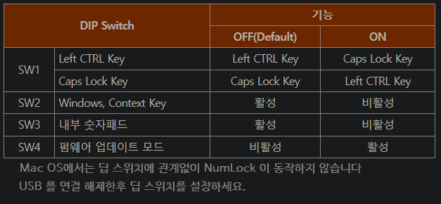

# Realforce Keyboard   
## 한영 전환 프로그램 : ChangeHanEng.zip
  - shift + space 키

## 바로 가기
- [Realforce 87 10th dip switch](#realforce-87-10th-dip-switch)
- [Realforce 2](#realforce-2)
- [Realforce 2 tl](#realforce-2-tl)
- [Realforce 3 Bluetooth](#realforce-3-bluetooth)
- [Realforce 3 Bluetooth tl](#realforce-3-bluetooth-tl)

 

## Realforce 87 10th dip switch
   

 

## Realforce 2
   

 

## Realforce 2 tl
   

 

## Realforce 3 Bluetooth
   

 

## Realforce 3 Bluetooth tl
   

 

